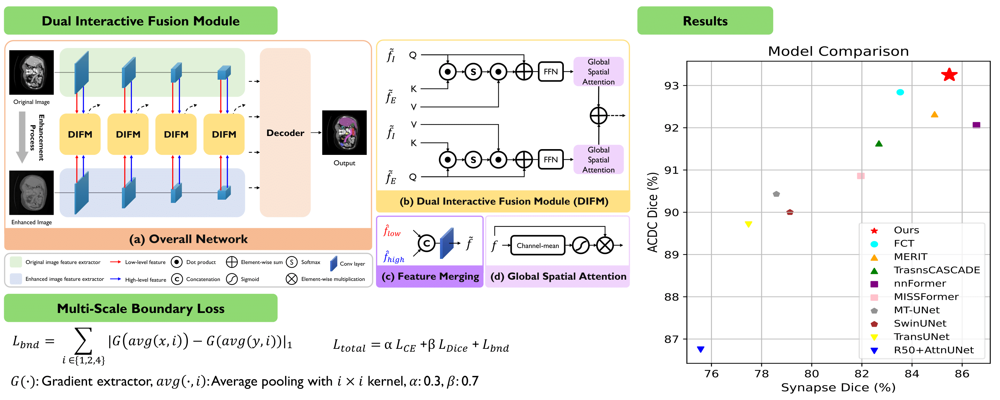
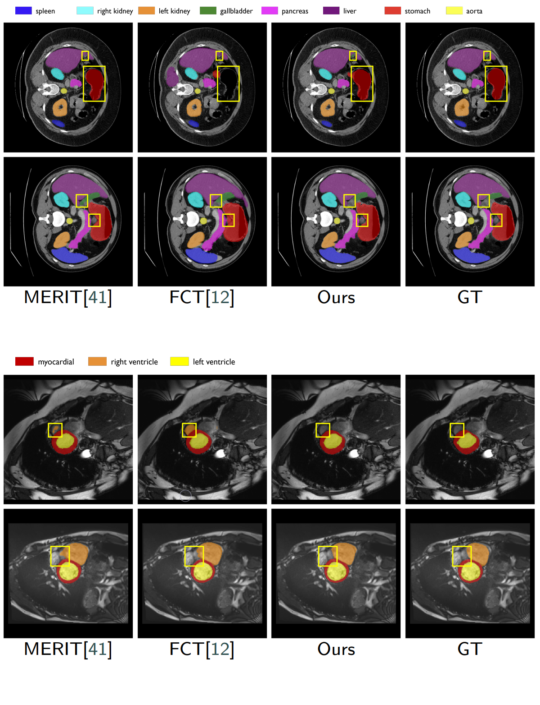

# Dual Interaction Network with Cross-Image Attention for Medical Image Segmentation

### Our paper is accepted at Pattern Recognition Letters!!

[Pattern Recognition Letters](https://doi.org/10.1016/j.patrec.2025.08.018)

Dataset Download Link : [Dataset](https://github.com/SLDGroup/MERIT/tree/main)

Code will be coming soon.

## Overall Architecture

<p align="center">

</p>

## Segmentation result

<p align="center">

</p>

### Acknowledgement

This code is based on [MERIT](https://github.com/SLDGroup/MERIT/tree/main). Thanks for the greatest project.

## Citations

```
@article{noh2025dual,
  title={Dual interaction network with cross-image attention for medical image segmentation},
  author={Noh, Jeonghyun and Jeon, Wangsu and Park, Jinsun},
  journal={Pattern Recognition Letters},
  year={2025},
  publisher={Elsevier}
}
```
